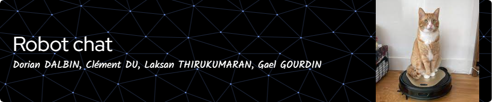
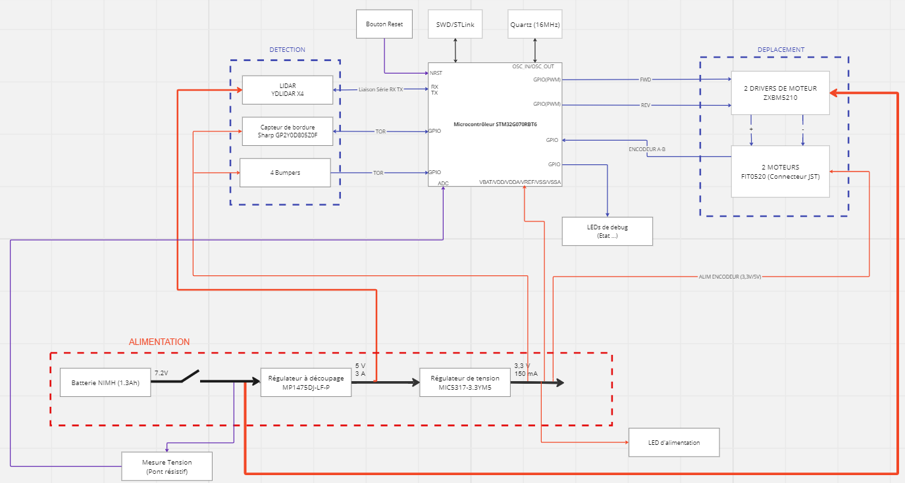

# Robot Chat et Souris

Ce projet consiste à créer un robot capable de jouer au jeu du chat et de la souris. Le robot est équipé de plusieurs fonctionnalités clés, notamment le contrôle de mouvement à l'aide de moteurs à courant continu (MCC), la localisation avec un Lidar YD X4, la détection du vide à l'aide de capteurs de bordure et le changement d'état ( Souris , Chat) grâce aux bumpers. 

## Schéma Fonctionnel : 
https://miro.com/app/dashboard/

## Fonctionnalités principales

1. **Contrôle de Mouvement (MCC) :**
   - Le robot est capable de se déplacer dans son environnement grâce à des moteurs à courant continu. 
2. **Localisation avec Lidar X4 :**
   - Utilisation du Lidar X4 pour permettre au robot de s'orienter et de se repérer dans son environnement.

3. **Détection du Vide avec Capteurs de Bordure et Changement d'état :**
   - Les capteurs de bordure sont utilisés pour détecter les zones sans sol, afin d'empêcher le robot de tomber.
   - Changement d'états (Souris, Chat) grâce aux bumpers : Utilisation de  bumpers placés sur chaque côté du robot. Lorsqu'un des bumpers est touché, on change  l'état du robot. 

## Utilisation

1. **Exécution du Programme :**
   - Pour démarrer le robot, exécutez le programme principal. Assurez-vous que toutes les dépendances sont installées et que le robot est correctement alimenté. Le robot démarre en mode Souris.

2. **Interface Utilisateur :**
   - Pour connaître les événements enregistrés par le robot, veuillez connecter une ST-link entre le robot et votre ordinateur, puis ouvrir une console (TeraTerm, Putty, ...) configurée en 115200 bauds.
   - Trois LEDs sont présentes sur le robot pour indiquer son état en temps réel :
        - Led verte :
        	- allumée : état chat
        	- éteinte : état souris
        - Led orange : changement d'état pour chaque détection de bordure.
        - Led rouge : le robot a rencontré un problème et doit être redémarré.

## Pilote Lidar pour système robotique

1. **Introduction :**

Le pilote Lidar consiste en l'intégration d'un lidar dans un système robotique tel que notre robot. Le lidar est utilisé pour la détection d'obstacles, la cartographie de l'environnement et la localisation des autres robots dans la zone d'opération. Ce document fournit des informations sur les fichiers principaux du projet, y compris les fichiers `drv_lidar.c`, `LidarTask.c`, et la création de la tâche Lidar.

2. **Contenu des fichiers :**

	#### `drv_lidar.c`

	Le fichier `drv_lidar.c` contient le code source pour le pilote du lidar. Il comprend les fonctionnalités suivantes :

	- **Initialisation du Lidar** : La fonction `LidarInit` initialise le lidar en configurant la communication UART, en créant un sémaphore pour la synchronisation des lectures UART, et en activant le l'échantillonage du lidar et son moteur.

	- **Communication UART** : Le fichier utilise la communication UART avec le mécanisme DMA pour une transmission et réception de données efficace et non bloquante.

	- **Commandes Lidar** : Les fonctions `LidarScanStart` et `LidarScanStop` envoient respectivement les commandes de démarrage et d'arrêt du scan au lidar.

	- **Traitement des données** : Les fonctions `getLidarScanData`, `checkCS` et `convertSample` sont responsables de la réception, de la vérification de la somme de contrôle et de la conversion des données de scan du lidar.

	- **Analyse des données Lidar** : La fonction `whereIsNearestRobot` analyse les données du lidar pour déterminer la position du robot le plus proche.

	- **Gestion des erreurs** : La fonction `LidarHealthStatus` permet d'obtenir le statut de santé du lidar et de gérer les erreurs éventuelles.

	- **Autres fonctionnalités** : Le fichier contient également des fonctions pour définir la vitesse du lidar, obtenir des informations sur le lidar et redémarrer le lidar.

	#### `LidarTask.c`

	Le fichier `LidarTask.c` contient la définition de la tâche Lidar. Il gère les états de la tâche, notamment l'initialisation du lidar, le scan, le traitement des données et le mode veille.

	- **États de la tâche** : Les états comprennent l'initialisation (`LIDAR_INIT`), le scan (`LIDAR_SCANNING`) et le mode veille (`LIDAR_STANDBY`).

	- **Initialisation** : La tâche commence par initialiser le lidar, récupérer des informations sur le lidar afin d'assurer son bon fonctionnement, puis passer à l'état de scan.

	- **Scan Lidar** : Dans cet état, la tâche démarre le scan du lidar, reçoit les données de scan, les traite et effectue des actions en fonction de l'état principal du système (CAT ou MOUSE).

	- **Mode veille** : Un état futur pour le mode veille est également prévu mais n'est pas encore implémenté.

	- **Gestion des erreurs** : En cas d'erreur lors du scan, la tâche passe à l'état d'erreur pour gérer la situation.

3. **Utilisation du code :**

	- **Création de la tâche Lidar** : La fonction `createLidarTask` dans `LidarTask.c` crée la tâche Lidar en utilisant FreeRTOS. Elle définit la profondeur de la pile et la priorité de la tâche.

	- **Configuration du Lidar** : Le fichier `drv_lidar.c` comprend des fonctions pour l'initialisation du lidar, la configuration de la vitesse du moteur, le démarrage et l'arrêt du scan, l'obtention d'informations, la récupération des données de scan, etc.

	- **Gestion des états** : La tâche Lidar gère différents états, tels que l'initialisation, le scan et la veille. Ces états sont définis dans `LidarTask.c` et peuvent être étendus selon les besoins.

	- **Analyse des données** : La fonction `whereIsNearestRobot` analyse les données du lidar pour déterminer la position du robot le plus proche. Cette fonction peut être adaptée en fonction des exigences spécifiques du projet.

4. **Remarques :**

	- Le pilote du lidar est conçu pour fonctionner avec FreeRTOS. Assurez-vous que votre projet est configuré pour utiliser FreeRTOS.

	- La communication avec le lidar utilise le DMA pour une transmission et une réception de données efficaces et non bloquantes via UART.

	- La fonction principale de la tâche Lidar est gérée par la fonction `lidarTask()`, qui comprend une machine d'états pour gérer les différents états du lidar.

	- La tâche Lidar s'exécute en boucle continue, surveillant et gérant l'état du dispositif lidar.

	- Des types de données personnalisés et des macros de journalisation sont définis dans `types.h` et `logger.h`, respectivement.

# Organisation des tâches 

Pour organiser nos tâches liées aux différentes fonctions du Lidar et des moteurs, nous avons crée une tache principale avec une priorité élevée ( code source dans mainTask.c). Cette tâche est divisé en plusieurs états :
   - Main Init : Initialisation des tâches de démarrage du Lidar, des moteurs et de l'asservissement.
   - ERROR : Gestion d'erreur
   - Mouse : Test de l'état avec une Led
   - CAT : Test de l'état avec une Led
( Pour l'état CAT/MOUSE, des notifications sont générées lorsque les bumpers sont appuyés)
   
   
Chaque état implique l'appels des tâches et des fonctions nécessaires. Un timer est configuré pour suivre l'état actuel du robot.

## Contrôle moteur et asservissement en vitesse

Les deux MCC sont controlés par des pwm et asservis en vitesse par un correcteur proportionnel dans une tâche.

1. **Driver de moteur :**

   Les fichiers `moteur_drv.c/.h` contiennent les fonctions permettant de commander la vitesse ainsi que les directions des moteurs et de générer les pwm en conséquence. Ils prévoient aussi le calcul de la vitesse des moteurs et la lecture des encodeurs.

2. **Conversion de la position visée en commande de vitesse pour les moteurs :**

   	Cette tâche reçoit une structure comprenant la position (angle et distance) à laquelle doit se rendre le robot. Ces données sont interprétées pour générer une commande (vitesse et sens de rotation) pour chaque moteur. La commande est ensuite utilisée pour l'asservissement en vitesse.

3. **Asservissement en vitesse :**

	La boucle d'asservissement en vitesse se fait toutes les 500 ms et comprend :

	- Récupération de la commande en vitesse en fonction de la position visée.
	- La lecture des encodeurs.
	- Le calcul de l'erreur entre la mesure et la commande en vitesse.
	- Le calcul de la nouvelle commande en vitesse par le correcteur proportionnel.
	- Transmission de la nouvelle commande de vitesse pour générer les pwm.

